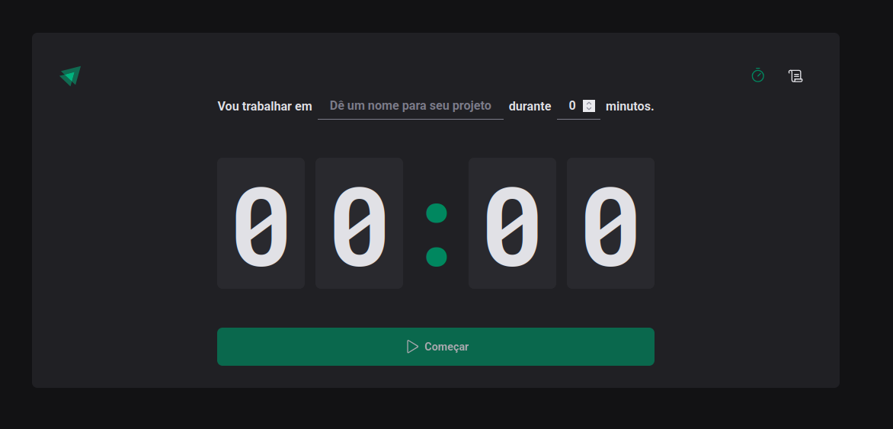

# IGNITE TIMER

<div style="text-align: center">
  
</div>

A ideia do projeto é ter um timer estilo timer com descrições, auxliando estilo em 'pomodoro'.

## TECNOLOGIAS

 - ReactJS
 - ViteJS
 - Styled-Components
 - Biome
 - Phosphor React
 - React Router Dom
 - React Hook Form
 - @hookform/resolvers
 - Zod

## DESAFIOS

Resiliente seria a palavra para representar o desafio de fazer o projeto. Mesmo fazendo o que se passava na aula muitas coisa mudaram durante o período que foram gravadas as aulas e eu tive que fazer isso tentando encontrar soluções atuais. 
Por exemplo fui apreender a usar Biome para fazer a formatação do meu projeto e ajudar em "intelisense" no vscode.

## INSTALANDO O PROJETO

  - Clonando o projeto: 

  ```bash 
  git clone git@github.com:AlysonDEV/ignite-timer.git
  ```

  - Abrir o projeto:

  ```bash
  cd ignite-timer
  ```

  -  Instalando as dependências:

  ```bash
  npm install
  ```

  - Para rodar o projeto em modo desenvolvimento:

  ```bash
  npm run dev
  ```

## PRÓXIMO NÍVEL

  - [x] Criação do REAMDE para apresentão do projeto estudado
  - [x] Favicon com o nome da aplicação
  - [x] Deploy da aplicação na vercel
